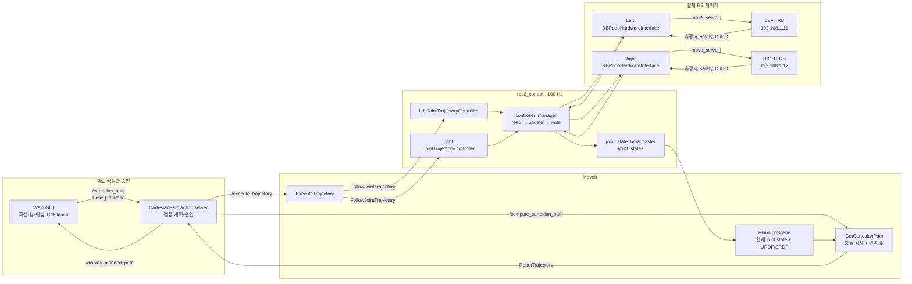
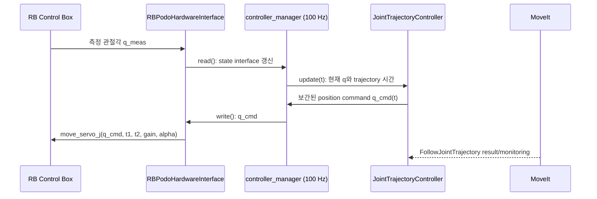
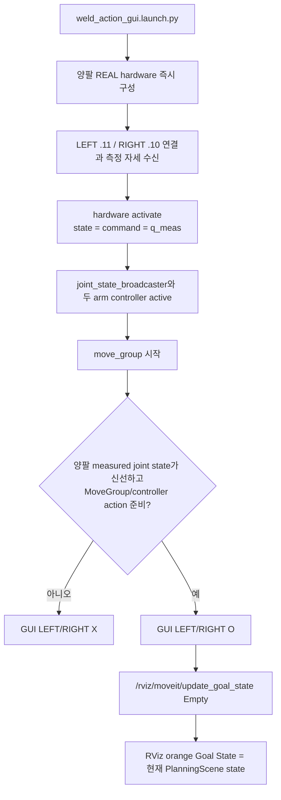

# 경로 생성과 로봇 이동의 수학·제어 흐름

이 문서는 `weld_action_gui`에서 만든 6D TCP 경로가 MoveIt 계획을 거쳐
두 RB 로봇의 관절 명령이 되기까지를 현재 코드 기준으로 설명한다. 좌표의
길이 단위는 m, 관절각은 rad, quaternion 순서는 ROS 표준인 `(x,y,z,w)`다.

## 1. 한눈에 보는 전체 구조

`Plan Preview`는 `CP`까지 수행하고 trajectory를 RViz에 표시한다. 실제
로봇을 움직이는 단계는 승인된 trajectory가 `ExecuteTrajectory`로 전달된
뒤부터다. 정상 실행 경로는 RBPodo의 `move_j`/`move_l` action을 직접 쓰지
않고, hardware interface의 `write()`가 `move_servo_j`를 전송한다.

## 2. 자세와 좌표계

한 TCP 자세는 위치 벡터와 단위 quaternion의 쌍이다.

\[
T = (\mathbf p,\mathbf q),\qquad
\mathbf p=[x\ y\ z]^T,\qquad
\|\mathbf q\|=1
\]

모든 GUI waypoint는 `World` 좌표계로 MoveIt에 전달된다. Tool 축으로 이동할
때는 TCP quaternion에 대응하는 회전행렬 \(R(\mathbf q)\)로 로컬 단위축을
World 방향으로 바꾼다.

\[
\mathbf d_{world}=R(\mathbf q)\mathbf e_{tool}
\]

quaternion의 노름이 0이거나 위치·자세에 NaN/Inf가 있으면 계획 요청 전에
거부한다.

## 3. 경로 생성 수학

### 3.1 World 또는 Tool 축 직선

시작 위치 \(\mathbf p_0\), 이동 거리 \(D\), 점 개수 \(N\)에 대해

\[
s_i=\frac{i}{N-1},\qquad
\mathbf p_i=\mathbf p_0+s_iD\mathbf d,\quad i=0,\ldots,N-1
\]

World 기준이면 \(\mathbf d\)는 World의 X/Y/Z 단위축이고, Tool 기준이면
\(\mathbf d=R(\mathbf q_0)\mathbf e\)다. 이 경로에서는 시작 quaternion을
모든 점에 그대로 유지한다. 음의 거리는 선택 축의 반대 방향 이동이다.

### 3.2 두 TCP 사이의 6D 직선

위치는 선형 보간한다.

\[
\mathbf p(s)=(1-s)\mathbf p_0+s\mathbf p_1,\qquad 0\le s\le1
\]

자세는 두 quaternion의 내적이 음수이면 끝 quaternion의 부호를 뒤집어
같은 회전의 짧은 호를 고른 뒤, 정규화 선형 보간(NLERP)한다.

\[
\mathbf q_1'=
\begin{cases}
-\mathbf q_1,&\mathbf q_0\cdot\mathbf q_1<0\\
 \mathbf q_1,&\text{otherwise}
\end{cases}
\]

\[
\mathbf q(s)=
\frac{(1-s)\mathbf q_0+s\mathbf q_1'}
{\|(1-s)\mathbf q_0+s\mathbf q_1'\|}
\]

현재 구현은 SLERP가 아니라 NLERP다. 계산이 단순하고 연속이지만, 회전
각속도가 수학적으로 완전히 일정하지는 않다.

### 3.3 World-YZ 원

현재 TCP 위치를 중심 \(\mathbf c=(c_x,c_y,c_z)\), 반지름을 \(r\)라 하면

\[
\theta_i=\frac{2\pi i}{N},\qquad
\mathbf p_i=
\begin{bmatrix}
c_x\\c_y+r\cos\theta_i\\c_z+r\sin\theta_i
\end{bmatrix}
\]

`closed`이면 마지막에 첫 점을 한 번 더 붙인다. `TCP +Z faces center`를
켜면 각 점의 TCP Z축은 원 중심을 향한다.

\[
\hat{\mathbf z}_i=(0,-\cos\theta_i,-\sin\theta_i),\quad
\hat{\mathbf x}_i=(1,0,0),\quad
\hat{\mathbf y}_i=\hat{\mathbf z}_i\times\hat{\mathbf x}_i
\]

세 축을 회전행렬의 열로 놓고 quaternion으로 변환한다. 옵션을 끄면 중심
TCP의 quaternion을 모든 점에 유지한다.

### 3.4 가르친 seam 위의 사인 위빙

먼저 입력 polyline의 각 구간 길이와 전체 길이를 구한다.

\[
L_k=\|\mathbf p_{k+1}-\mathbf p_k\|,\qquad L=\sum_k L_k
\]

`cycles × samples_per_cycle + 1`개의 점을 호 길이에 균등하게 재표본화한다.
각 점의 구간 접선 \(\hat{\mathbf t}\)에 대해 사용자가 고른 Tool/World 축
\(\mathbf a\)의 접선 성분을 제거하고 정규화해 횡방향을 만든다.

\[
\mathbf n=
\frac{\mathbf a-(\mathbf a\cdot\hat{\mathbf t})\hat{\mathbf t}}
{\|\mathbf a-(\mathbf a\cdot\hat{\mathbf t})\hat{\mathbf t}\|}
\]

선택 축이 접선과 평행해 분모가 0에 가까우면, 접선과 가장 덜 평행한 축을
자동 선택한다. 진폭 \(A\), cycle 수 \(C\), 정규화 호 길이 \(s\)에 대해

\[
\mathbf p_{weave}(s)=\mathbf p_{seam}(s)
+A\sin(2\pi Cs)\mathbf n(s)
\]

자세는 원본 seam의 인접 자세를 NLERP한 값을 유지한다.

## 4. Cartesian waypoint에서 관절 trajectory까지

GUI의 점들은 곧바로 로봇에 전송되지 않는다. action server가
`GetCartesianPath`에 다음 조건으로 요청한다.

- group: `left_manipulator` 또는 `right_manipulator`
- tip: 해당 arm의 `*_manipulator_ee_point`
- frame: `World`
- `max_step = 0.005 m`
- `jump_threshold = 0.0`
- `avoid_collisions = true`
- start state: PlanningScene이 받은 최신 `/joint_states`

MoveIt은 각 Cartesian 표본에서 전진기구학
\(T=f(\mathbf q)\)을 만족하는 관절값을 연속적으로 찾는다. 국소적으로는
Jacobian \(J(\mathbf q)\)가 TCP 미소변위와 관절 미소변위를 연결한다.

\[
\Delta\mathbf x \approx J(\mathbf q)\Delta\mathbf q,\qquad
\Delta\mathbf q \approx J^+(\mathbf q)\Delta\mathbf x
\]

실제 IK solver는 설정된 KDL plugin이며, 위 식은 동작을 이해하기 위한
배경이다. 각 표본은 joint limit, self-collision, 양팔 상호 collision과
환경 collision을 통과해야 한다. 전체 요구 구간의 비율이 0.999 미만이면
현재 action server는 실행하지 않는다.

ARC를 사용할 때는 현재 자세→TCP1 접근과 TCP1→TCP2 seam을 별도 계획하고,
접근 trajectory의 마지막 관절 상태를 seam의 시작 상태로 사용한다. 따라서
두 trajectory의 상태가 수학적으로 이어진다.

## 5. 시간과 속도 스케일

MoveIt이 만든 점의 원래 시간, 속도, 가속도를 각각 \(t,\dot q,\ddot q\),
GUI scale을 \(v\in(0,1]\)라 하면 현재 코드는

\[
t'=\frac{t}{v},\qquad
\dot q'=v\dot q,\qquad
\ddot q'=v^2\ddot q
\]

로 바꾼다. 예를 들어 20%는 수행 시간을 5배로 늘리고 속도를 0.2배,
가속도를 0.04배로 만든다. MoveIt pipeline에는 TOTG 시간 매개화 뒤 Ruckig
jerk smoothing이 설정되어 있다. 별도 GUI scale은 반환된 trajectory에
추가 적용된다.

## 6. ros2_control 폐루프

controller manager의 주기는 100 Hz다. 두 arm controller는 position command와
실제 position state를 쓰며 `open_loop_control: false`다. partial joint goal은
허용하지 않는다. 설정된 허용오차는 각 관절 trajectory 0.15 rad, goal
0.02 rad, goal time 2 s다.

hardware의 상태 수집 thread는 500 Hz를 목표로 하고, arm별 `system_state`는
약 10 Hz로 GUI에 발행된다. `/joint_states`는 controller loop를 따라 MoveIt,
robot_state_publisher와 RViz에 전달된다.

시작할 때 임의의 YAML 초기 관절각을 명령하지 않는다. hardware activation이
RB의 측정 관절각을 state와 command 양쪽에 먼저 복사하므로 최초 command가
현재 자세와 일치해야 한다. 이후에만 trajectory controller가 시간에 따른
명령을 만든다.

## 7. 시작·연결·RViz 동기화

O/X는 단순 ping 결과가 아니다. `/joint_states`에 해당 arm의 유효한 6축
측정값이 모두 있고 `/move_action`, 실행 모드의 `FollowJointTrajectory`
action이 준비되어야 O다. `system_state`는 touch DI와 상세 상태 감시에 쓴다.
RViz Goal State 갱신용 Empty 메시지는 표시 상태만 바꾸며 trajectory 실행을
요청하지 않는다.

이 사용자 launch는 ros2_control, MoveIt, RViz와 GUI의 Fast DDS transport를
모두 `UDPv4`로 통일하고 `ROS_LOCALHOST_ONLY=1`로 loopback에 고정한다.
shared-memory lock 장애와 유선·Wi-Fi NIC 분산으로 endpoint만 발견되고 실제
topic/service 데이터가 멎는 상태를 방지한다. RB/H600의 별도 TCP에는 영향을
주지 않는다.

## 8. 통신 경계와 고장 해석

| 구간 | 인터페이스 | 끊기면 보이는 현상 |
|---|---|---|
| RB 상태 → hardware | RBPodo 상태 TCP | `system_state` stale, GUI X, `/joint_states` 정지 가능 |
| MoveIt → controller | `FollowJointTrajectory` action | plan은 되지만 execute 거부/실패 |
| controller → hardware | ros2_control position interface | controller active여도 실제 명령 전달 불가 |
| hardware → RB | RBPodo command TCP, `move_servo_j` | connection lost, pendant external-command 상태 소실 |
| joint state → MoveIt | `/joint_states` | 현재 state 불명, planning start state 오류 |

주황색 pendant 표시는 보통 외부 servo 명령 상태와 관련 있지만, GUI의 O와
동일한 신호는 아니다. GUI O는 ROS stack 준비 상태까지 포함하고, pendant는
RB 제어기 내부 상태를 보여준다.

실행 전에는 다음 세 조건을 따로 확인해야 한다.

1. **현재 상태:** 양팔 `/joint_states`와 `system_state`가 계속 갱신된다.
2. **계획:** path fraction이 0.999 이상이고 collision/joint limit 오류가 없다.
3. **실행:** 두 arm controller가 active이고 승인한 trajectory와 현재 상태의
   시작 오차가 허용 범위 안이다.

## 9. 구현 위치

| 기능 | 파일 |
|---|---|
| 직선·원·위빙·자세 보간·속도 scale | `construct_robot/cartesian_path_common.py` |
| MoveIt 계획, 승인 trajectory 보관, 실행 | `construct_robot/cartesian_path_server.py` |
| GUI, TF pose 취득, 연결 O/X, RViz Goal 갱신 | `construct_robot/weld_action_gui.py` |
| controller 주기와 오차 설정 | `construct_moveit_config/config/ros2_controllers.yaml` |
| planning adapter | `construct_moveit_config/config/ompl_planning.yaml` |
| hardware plugin 선택과 joint interface | `construct_description/urdf_0528/construct_robot_0528.ros2_control.xacro` |
