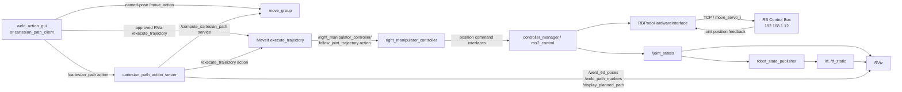

# KIRO ROS 2 graph and debugging map

This document separates the planning, visualization, control, and RB hardware
layers. All names below assume the default namespace.

## End-to-end path



The normal MoveIt execution path does **not** call RB Podo `move_j` or `move_l`
actions. The joint trajectory controller writes ros2_control position command
interfaces. `RBPodoHardwareInterface::write()` then streams those positions to
the control box using `move_servo_j`.

The GUI uses the custom `/cartesian_path` action for Cartesian seam motion.
Named joint poses use MoveIt's standard `/move_action`, while execution of an
already approved RViz trajectory uses `/execute_trajectory`. These interfaces
have different request/result types, but the GUI routes their common goal
submission, acceptance, timeout, cancellation, and result lifecycle through
one internal action helper.

## Application nodes

| Node | Receives | Sends | Purpose |
|---|---|---|---|
| `/weld_action_gui` | `World → right_manipulator_ee_point` TF; `/cartesian_path` feedback/result | `/cartesian_path` goals; `/weld_path_markers`; `/weld_6d_poses` | Acquire/generate/edit a weld path and request right-arm planning |
| `/laser_weld_path_action_client` | TF for live scenarios; `/cartesian_path` feedback/result | `/cartesian_path` goal | Command-line scenario client |
| `/cartesian_path_action_server` | `/cartesian_path` goals; `/compute_cartesian_path` response; `/execute_trajectory` result | weld visualization topics; `/display_planned_path`; MoveIt service/action requests | Validate, visualize, plan, optionally execute |
| `/robot_state_publisher` | `/joint_states`, `robot_description` | `/tf`, `/tf_static` | Joint state to link-frame transforms |
| `/move_group` | `/joint_states`, planning scene and requests | planning services/actions, `/display_planned_path`, monitored scene | MoveIt planning and execution coordinator |

## Custom Cartesian action

Action name and type:

```text
/cartesian_path
construct_msgs/action/CartesianPath
```

Goal:

| Field | Meaning |
|---|---|
| `waypoints` | Ordered `geometry_msgs/Pose[]` in `World` |
| `planning_group` | `right_manipulator` or `left_manipulator` |
| `interpolation_step` | Maximum Cartesian sample spacing in metres |
| `velocity_scale` | `(0, 1]`; scales trajectory time, velocity and acceleration |
| `execute_requested` | `false` previews/approves; `true` requests controller execution |
| `reuse_approved_plan` | Execute only the last exactly matching path/speed plan |
| `visualize_path` | Show/hide compact 6D waypoint markers and connecting line |

Feedback contains `current_pose`, `waypoint_index`, and `progress`. Result
contains `success`, `message`, `final_pose`, and `sampled_path`.

ROS actions expand internally to send-goal, get-result and cancel services plus
feedback/status topics. Use `ros2 action` commands instead of depending on
those generated endpoint names directly.

## Visualization contracts

| Topic | Type | Publisher | Consumers |
|---|---|---|---|
| `/joint_states` | `sensor_msgs/JointState` | `joint_state_broadcaster` | MoveIt, robot_state_publisher, RViz |
| `/right_rbpodo_hardware/system_state` | `rbpodo_msgs/SystemState` | Right RB hardware node | Weld GUI control-box DI/DO monitor |
| `/left_rbpodo_hardware/system_state` | `rbpodo_msgs/SystemState` | Left RB hardware node | GUI REAL-connection confirmation and touch input |
| `/tf` | `tf2_msgs/TFMessage` | robot_state_publisher and static publishers | RViz, GUI TF buffer |
| `/weld_path_markers` | `visualization_msgs/MarkerArray` | GUI and action server | RViz |
| `/weld_6d_poses` | `geometry_msgs/PoseArray` | GUI and action server | RViz |
| `/display_planned_path` | `moveit_msgs/DisplayTrajectory` | action server, MoveIt/Tesseract demos | RViz |
| `/monitored_planning_scene` | `moveit_msgs/PlanningScene` | move_group | RViz MotionPlanning display |

RViz displays live state from `/joint_states` in the `World` frame. Its
MotionPlanning gizmo is a local goal-state interactive marker, while plan
previews arrive separately on `/display_planned_path`.

## MoveIt and controller interfaces

The action server uses:

- `/compute_cartesian_path`
  (`moveit_msgs/srv/GetCartesianPath`)
- `/execute_trajectory`
  (`moveit_msgs/action/ExecuteTrajectory`)

MoveIt sends trajectories to:

- `/right_manipulator_controller/follow_joint_trajectory`
- `/left_manipulator_controller/follow_joint_trajectory`
- `/robot_head_controller/follow_joint_trajectory`

All use `control_msgs/action/FollowJointTrajectory`. Controller lifecycle and
hardware interfaces are managed by `/controller_manager`; inspect its services
with:

```bash
ros2 service list | grep controller_manager
ros2 control list_controllers
ros2 control list_hardware_interfaces
```

## RB hardware layer

The normal GUI launch loads `rbpodo_hardware/RBPodoHardwareInterface` for
both arms. The right system uses:

```text
hardware_namespace = right
robot_ip = 192.168.1.12
```

The hardware plugin exposes joint position/velocity/effort command interfaces
and position/effort state interfaces. The trajectory controller currently
claims only the six right-arm **position** command interfaces.

The plugin also creates `/right_rbpodo_hardware` with lower-level services such
as `eval`, `task_*`, `set_speed_bar`, and controller configuration, plus
`move_j`, `move_l`, `move_jb2`, and `move_pb` actions. These are available for
direct RB Podo workflows but are separate from this MoveIt trajectory path.
The left robot uses the equivalent `/left_rbpodo_hardware/*` names.

## Commands for self-debugging

Start the normal physical dual-arm stack:

```bash
source /home/irs/ros2_ws/install/setup.bash
ros2 launch construct_robot weld_action_gui.launch.py \
  execute_motion:=false
```

This still connects both physical RB controllers. `execute_motion:=false`
prevents MoveIt trajectory execution but is not a fake-hardware mode and the
driver can still perform connection-time configuration. Use only with the
robot workcell in a safe state.

Inspect the runtime graph:

```bash
ros2 node list
ros2 node info /cartesian_path_action_server
ros2 node info /weld_action_gui
ros2 topic info /joint_states --verbose
ros2 topic info /display_planned_path --verbose
ros2 service type /compute_cartesian_path
ros2 action info /cartesian_path
ros2 action info /execute_trajectory
ros2 action info /right_manipulator_controller/follow_joint_trajectory
```

Watch data:

```bash
ros2 topic hz /joint_states
ros2 topic echo /weld_6d_poses --once
ros2 topic echo /display_planned_path --once
ros2 topic echo /tf --field transforms
```

Check frames:

```bash
ros2 run tf2_ros tf2_echo World right_manipulator_ee_point
ros2 run tf2_tools view_frames
```

Check controller ownership:

```bash
ros2 control list_controllers
ros2 control list_hardware_components
ros2 control list_hardware_interfaces
```

For actual hardware, verify the controller list, TCP reachability, operation
mode, and a low velocity scale before enabling `execute_motion:=true`.

## Hi-COMM welding

The weld GUI connects directly to the digital welder over TCP using
`hicomm_welder.py`. Welding commands are explicit Sequence Builder D-WELD
SET/ON/OFF steps and are intentionally separate from `/cartesian_path` motion.
