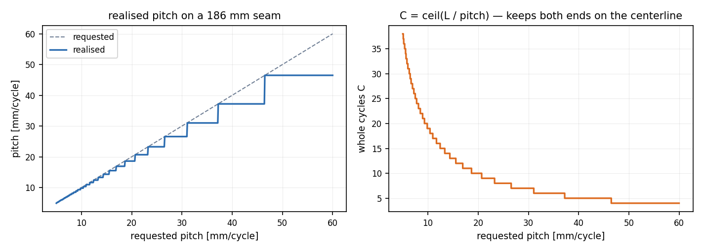
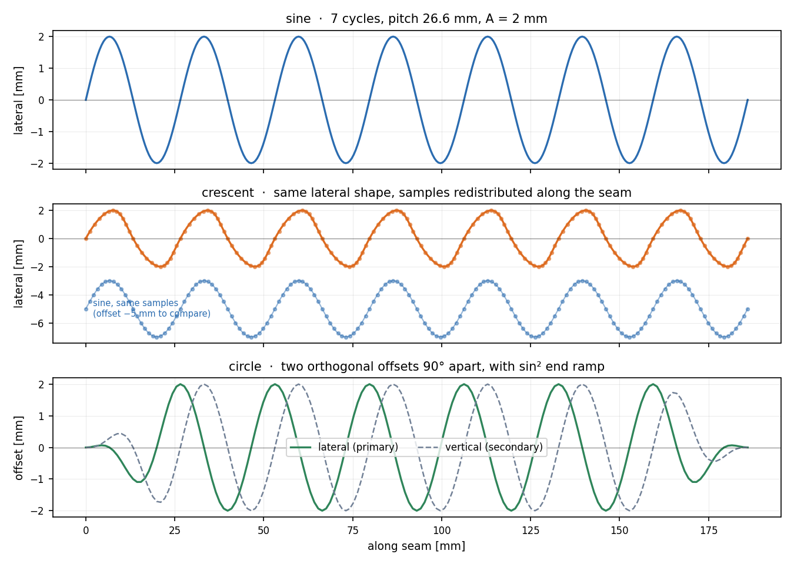
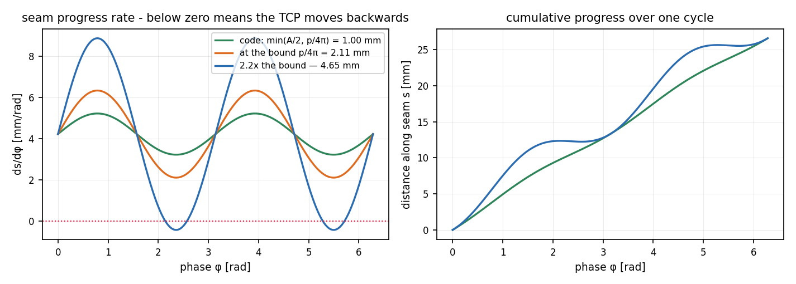
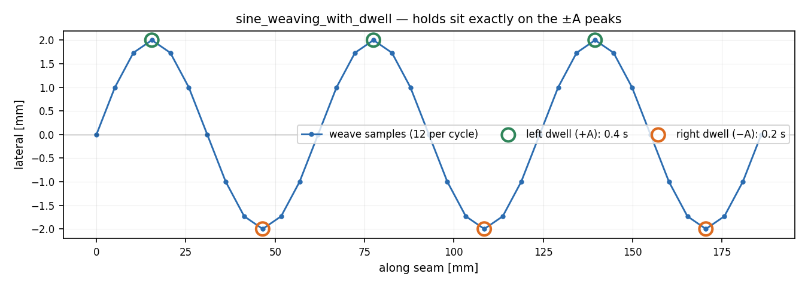
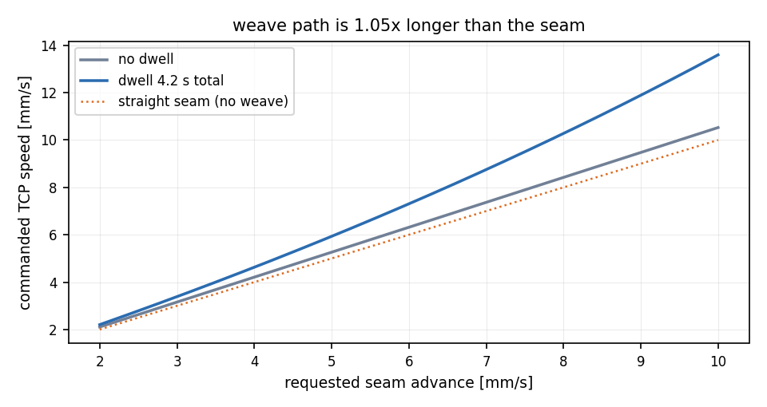
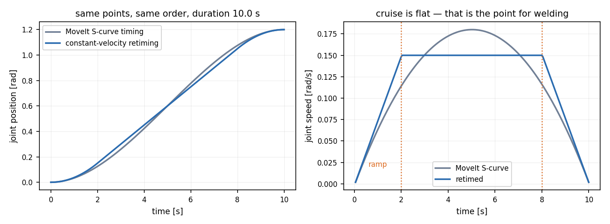
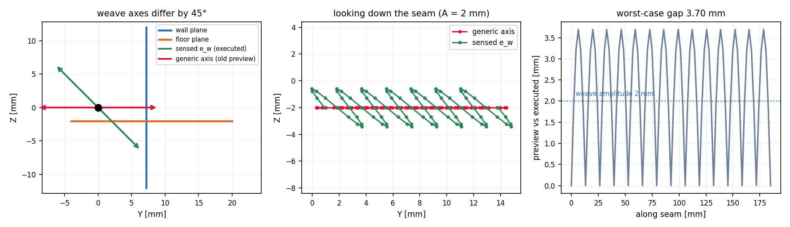
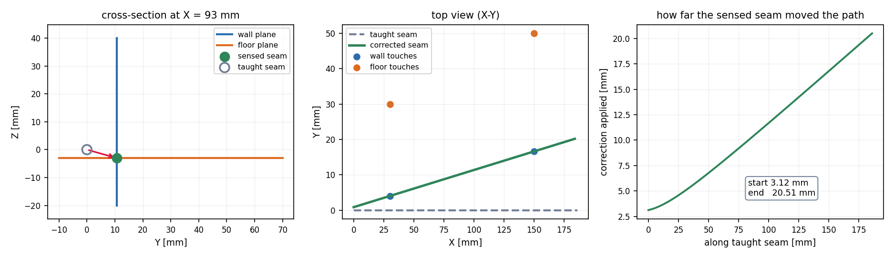

# 용접 경로 수학 — 수식과 그림

코드가 실제로 무엇을 계산하는지를 수식과 그림으로 정리한 문서입니다.

[`MOTION_MATH_AND_CONTROL_FLOW.md`](MOTION_MATH_AND_CONTROL_FLOW.md) 가 전체 제어
흐름(GUI → MoveIt → ros2_control → RB 제어박스)과 기본 사인 위빙을 다룹니다.
이 문서는 **그 문서가 다루지 않는 수학**에 집중합니다 — crescent·circle 위빙,
dwell, 속도 환산, 등속 재타이밍, 터치 기반 seam 보정, IL의 seam 좌표계 — 그리고
모든 항목에 그림을 붙입니다.

> **그림은 전부 실제 코드가 만든 출력입니다.** 손으로 다시 그린 것이 하나도
> 없습니다. [`make_weld_math_figures.py`](make_weld_math_figures.py) 가
> `cartesian_path_common.py` 와 `weld_action_gui.py` 의 함수를 그대로 호출해
> 그립니다. 위빙 수학을 고치면 그림도 따라 바뀌고, 문서가 거짓말을 시작하지
> 않습니다.
>
> ```bash
> source src/construct_robot_ros2/scripts/use_ros_python.bash
> python3 src/construct_robot_ros2/docs/make_weld_math_figures.py
> ```

## 기호

| 기호 | 뜻 | 코드 |
|---|---|---|
| $L$ | seam 전체 길이 [m] | `total_length` |
| $C$ | 정수 cycle 수 | `cycles` |
| $p = L/C$ | 실제 pitch [m/cycle] | 반환값 |
| $A$ | 한쪽 진폭 [m] | `amplitude` |
| $s$ | seam를 따라 간 호 길이 [m] | `target_distance` |
| $u = s/L$ | 정규화 진행률 $\in[0,1]$ | `ratio` |
| $\varphi = 2\pi C u$ | 위빙 위상 [rad] | `phase` |
| $\hat{\mathbf t}$ | 국소 접선 단위벡터 | `tangent` |
| $\mathbf a$ | 사용자가 고른 Tool/World 축 | `axis_vectors[...]` |
| $\hat{\mathbf n}$ | 횡방향 단위벡터 | `transverse` |

---

## 1. 위빙

### 1.1 pitch는 요청값이고, cycle은 정수다

위빙이 중심선에서 시작해 중심선에서 끝나려면 cycle 수가 정수여야 합니다. 그래서
사용자가 넣은 pitch는 **최대값**으로만 쓰이고, 실제 pitch는 나눗셈 결과입니다.

$$C=\max\left(1,\ \left\lceil \frac{L}{p_{\text{req}}} \right\rceil\right),
\qquad p_{\text{actual}}=\frac{L}{C}$$

`weave_cycles_for_pitch` — `cartesian_path_common.py`. 상한 100 cycle을 넘으면
예외를 던집니다.



186 mm seam에서 요청 pitch를 5→60 mm로 훑은 결과입니다. 실제 pitch는 항상 요청값
**이하**이고 계단 모양입니다. 30 mm를 요청하면 $C=\lceil 186/30 \rceil = 7$,
실제 pitch는 26.6 mm가 됩니다.

### 1.2 횡방향 축: 접선 성분 제거

사용자가 고른 축 $\mathbf a$ 를 그대로 쓰면 경로 진행 방향 성분이 섞입니다.
그람-슈미트로 접선 성분을 빼고 정규화합니다.

$$\hat{\mathbf n}=\frac{\mathbf a-(\mathbf a\cdot\hat{\mathbf t})\,\hat{\mathbf t}}
{\lVert \mathbf a-(\mathbf a\cdot\hat{\mathbf t})\,\hat{\mathbf t}\rVert}$$

`tool_*` 축이면 $\mathbf a$ 를 먼저 현재 TCP 자세로 회전시킵니다
($\mathbf a \leftarrow R(\mathbf q)\,\mathbf a$). 분모가 0에 가까우면 — 고른 축이
접선과 거의 평행하면 — 접선과 **가장 덜 평행한** 축으로 자동 대체합니다.

$$\mathbf a_{\text{fallback}}=\arg\min_{\mathbf e\in\{\pm x,\pm y,\pm z\}}
\lvert \mathbf e\cdot\hat{\mathbf t}\rvert$$

### 1.3 세 가지 패턴



**sine** — 횡방향으로만 진동합니다.

$$\mathbf p(u)=\mathbf p_{\text{seam}}(s)+A\sin\varphi\;\hat{\mathbf n},
\qquad s=Lu$$

**crescent** — 횡방향 오프셋은 sine과 **같습니다.** 다른 것은 seam 위의
**진행 방식**입니다. 각 표본을 앞쪽으로 부풀려서, 토치가 반 주기마다 전진하며
초승달을 그리게 합니다.

$$s(\varphi)=Lu+\frac{b}{2}\bigl(1-\cos 2\varphi\bigr)$$

그래서 가운데 그림에서 곡선 모양은 sine과 같은데 **표본이 몰리는 위치**가
다릅니다 (주황 점이 봉우리 근처에 뭉치고, 파란 sine 점은 균등합니다).

**circle** — 서로 직교하는 두 방향으로 90° 위상차를 두어 원을 그립니다. 1차 방향은
§1.2와 같고, 2차 방향은 외적으로 만듭니다.

$$\hat{\mathbf m}=\hat{\mathbf t}\times\hat{\mathbf n}$$

$$\mathbf p(u)=\mathbf p_{\text{seam}}(s)
+R\,E(u)\bigl(\cos\varphi\;\hat{\mathbf n}+\sin\varphi\;\hat{\mathbf m}\bigr)$$

양 끝에서 원 위로 갑자기 튀어오르지 않도록 한 cycle에 걸친 포락선을 씁니다.

$$E(u)=\sin^2\!\left(\frac{\pi}{2}\min\bigl(1,\ Cu,\ C-Cu\bigr)\right)$$

아래 그림 3행에서 양 끝이 0에서 부드럽게 올라오는 부분이 이 $E(u)$ 입니다.

### 1.4 crescent bulge 상한 — 왜 그 값인가

crescent에서 $b$ 를 키우면 토치가 **뒤로 갈** 수 있습니다. 진행률을 위상으로
미분하면:

$$\frac{ds}{d\varphi}=\frac{p}{2\pi}+b\sin 2\varphi$$

최솟값은 $\varphi$ 가 $\sin 2\varphi=-1$ 일 때이므로, 단조 증가 조건은

$$\frac{p}{2\pi}-b>0 \quad\Longleftrightarrow\quad b<\frac{p}{2\pi}$$

코드는 여기에 **2배 여유**를 두고 $b=\min\!\left(\dfrac{A}{2},\ \dfrac{p}{4\pi}\right)$
를 씁니다 (`weaving_from_path` 의 `crescent_bulge_m`).



왼쪽이 $ds/d\varphi$ 입니다. 초록(코드 값)과 주황(코드 상한 $p/4\pi$)은 0 위에
넉넉히 떠 있고, 파랑(그 2.2배 = 엄밀 한계 $p/2\pi$ 초과)은 0 아래로 내려갑니다 —
저 구간에서 토치가 후진합니다. 오른쪽 누적 그래프에서 파랑이 평평해지는 구간이
그것입니다.

> 코드 주석은 이 상한이 "seam progress를 엄밀히 증가시킨다"고만 적어두었는데,
> 실제로는 엄밀 한계의 **절반**이라 2배 안전 여유가 있습니다.

### 1.5 dwell — 봉우리에서 멈추기

`sine_weaving_with_dwell` 은 cycle당 표본을 **12개로 고정**합니다. 12는 임의의 수가
아니라 $\pm A$ 봉우리에 표본이 정확히 떨어지게 하는 값입니다:
$\sin(2\pi k/12)=\pm1$ 은 $k=3,9$ 에서 성립합니다.

$$\text{hold}[12c+3]=t_{\text{left}},\qquad
\text{hold}[12c+9]=t_{\text{right}},\qquad c=0,\dots,C-1$$



양 끝점은 원본 seam 자세로 되돌려 놓아(`points[0]`, `points[-1]`) 위빙이 정확히
티칭된 시작·끝에서 시작하고 끝나게 합니다.

### 1.6 속도 환산 — 위빙 경로는 seam보다 길다

작업자가 지정하는 값은 **seam 진행 속도** $v_{\text{seam}}$ 인데, 로봇에 보내야 하는
값은 **TCP 경로 속도** 입니다. 위빙 경로 길이 $L_{\text{path}}$ 는 seam 길이보다
길고, dwell은 이동에 쓸 시간을 빼앗습니다.

$$t_{\text{target}}=\frac{L}{v_{\text{seam}}},\qquad
t_{\text{moving}}=t_{\text{target}}-\sum_i \text{hold}_i$$

$$v_{\text{TCP}}=\frac{L_{\text{path}}}{t_{\text{moving}}}$$

`weave_path_speed_m_s`. $t_{\text{moving}}\le 0$ 이면 — dwell 합이 목표 시간보다
크면 — 예외를 던집니다.



2 mm 진폭·26.6 mm pitch에서 위빙 경로는 seam의 약 1.2배입니다. dwell을 더하면
곡선이 위로 휘는데, 남은 이동 시간이 줄어 같은 seam 속도를 맞추려면 더 빨리
움직여야 하기 때문입니다. seam 속도를 낮출수록 dwell의 상대 비중이 줄어 두 곡선이
가까워집니다.

---

## 2. 등속 재타이밍

MoveIt은 TOTG + Ruckig로 jerk 제한 S-curve를 만듭니다. 부드럽지만 **항상 가감속
중**이라 속도가 일정한 구간이 없습니다. 용접에서는 입열량이 속도에 반비례하므로
비드 폭이 계속 변합니다.

`retime_trajectory_constant_velocity` 는 **위치와 점 순서는 그대로 두고 시간만**
다시 매깁니다. 먼저 관절공간 누적 거리를 경로 진행 지표로 씁니다 (FK 불필요,
단조성 보장):

$$d_k=\sum_{j<k}\lVert \mathbf q_{j+1}-\mathbf q_j\rVert,\qquad D=d_{N-1}$$

램프 시간 $t_r$, 순항 속도 $v_c$, 램프 거리 $d_r=\tfrac12 v_c t_r$ 에 대해 각 점의
새 시각은 구간별로:

$$t(d)=\begin{cases}
\sqrt{\dfrac{2 t_r d}{v_c}} & d\le d_r \quad\text{(가속)}\\[2ex]
t_r+\dfrac{d-d_r}{v_c} & d_r<d<D-d_r \quad\text{(순항)}\\[2ex]
T-\sqrt{\dfrac{2t_r (D-d)}{v_c}} & d\ge D-d_r \quad\text{(감속)}
\end{cases}$$

두 가지 모드가 있습니다.

| 모드 | $t_r$ | $v_c$ | 총 시간 |
|---|---|---|---|
| `ramp_fraction=f` (기본 0.2) | $fT_0$ | $D/(T_0-t_r)$ | $T_0$ 유지 |
| `ramp_duration_s=t_r` | $t_r$ | $D/T_0$ | $T_0+t_r$ |

두 번째 모드가 물리적 TCP 속도 목표용입니다. 입력 평균 속도가 **순항 속도**가 되고
양 끝에 고정 램프가 붙습니다 (반속 램프 두 개 = 램프 시간 하나만큼 총 시간 증가).

속도·가속도는 새 시각으로 중앙 차분해서 다시 채웁니다. 양 끝점은 0으로 둡니다.

$$\dot q_k=\frac{q_{k+1}-q_{k-1}}{t_{k+1}-t_{k-1}},\qquad
\ddot q_k=\frac{\dot q_{k+1}-\dot q_{k-1}}{t_{k+1}-t_{k-1}}$$



오른쪽이 핵심입니다. 회색(MoveIt S-curve)은 속도가 계속 변하지만, 파랑(재타이밍)은
가운데가 **완전히 평평**합니다. 왼쪽에서 보듯 지나는 위치는 동일하고 총 시간도
같습니다 — 바뀐 것은 시간 배분뿐입니다.

단조성 보정도 들어 있습니다. 수치 오차로 $t_k<t_{k-1}$ 이 되면 앞 값으로 눌러
시간이 뒤로 가지 않게 합니다.

---

## 3. 터치 기반 seam 보정

티칭한 seam과 실제 부재 위치는 다릅니다. 토치를 벽면·바닥면에 접촉시켜 두 평면을
추정하고, **그 교선**을 실제 용접선으로 잡습니다.

### 3.1 평면 추정

접촉점 하나로는 평면이 정해지지 않습니다 (법선 방향이 자유). 접촉점이 둘 이상이면
그 연결 벡터가 실제 표면 위에 있으므로, 설정된 프로브 법선 힌트
$\mathbf n_{\text{hint}}$ 에서 그 방향 성분을 제거해 실제 기울기를 반영합니다.

$$\hat{\mathbf t}_{\text{span}}=\frac{\mathbf p_b-\mathbf p_a}{\lVert\mathbf p_b-\mathbf p_a\rVert},
\qquad
\hat{\mathbf n}=\frac{\mathbf n_{\text{hint}}-(\mathbf n_{\text{hint}}\cdot\hat{\mathbf t}_{\text{span}})\hat{\mathbf t}_{\text{span}}}
{\lVert\cdot\rVert}$$

$\mathbf p_a,\mathbf p_b$ 는 접촉점 중 **가장 멀리 떨어진 쌍**입니다 (기울기 추정
레버암을 최대화). 평면 상수는 접촉점들의 평균 투영에 오프셋을 더한 값입니다.

$$c=\frac{1}{m}\sum_{i=1}^{m}\hat{\mathbf n}\cdot\mathbf p_i+\delta$$

`compute_surface_plane` — `weld_action_gui.py`.

### 3.2 두 평면의 교선

평면 $\hat{\mathbf n}_w\cdot\mathbf x=c_w$ 와 $\hat{\mathbf n}_f\cdot\mathbf x=c_f$ 의
교선 방향은 외적입니다.

$$\hat{\mathbf d}=\pm\frac{\hat{\mathbf n}_w\times\hat{\mathbf n}_f}
{\lVert\hat{\mathbf n}_w\times\hat{\mathbf n}_f\rVert}$$

부호는 티칭된 seam 방향과 내적이 양수가 되도록 고릅니다 — 교선 자체는 방향이
없지만 용접은 방향이 있기 때문입니다 (`compute_real_seam_direction`).

교선 위의 점은 **최소 노름 해**를 씁니다. $\kappa=\hat{\mathbf n}_w\cdot\hat{\mathbf n}_f$
라 두면:

$$\mathbf x_0=\alpha\,\hat{\mathbf n}_w+\beta\,\hat{\mathbf n}_f,\qquad
\alpha=\frac{c_w-\kappa c_f}{1-\kappa^2},\quad
\beta=\frac{c_f-\kappa c_w}{1-\kappa^2}$$

$1-\kappa^2<10^{-12}$ 이면 — 두 평면이 거의 평행하면 — 교선이 수치적으로 불안정하므로
예외를 던집니다.

### 3.3 seam 로컬 프레임 — 위빙은 어느 평면에서 흔드는가

보정된 seam에서는 위빙 방향을 **센싱된 평면에서 유도**합니다. Tool/World 축을 쓰면
안 되는 이유가 여기 있습니다.

접근 방향은 두 평면 법선의 이등분선입니다 (필릿 이음의 "구석을 향하는" 방향).

$$\mathbf e_a^{(0)}=\frac{\hat{\mathbf n}_w+\hat{\mathbf n}_f}{\lVert\hat{\mathbf n}_w+\hat{\mathbf n}_f\rVert}$$

부호는 티칭된 Tool $+Z$ 의 평균과 내적이 양수가 되도록 고르고, 티칭된 WAIT 자세가
있으면 그 바깥 방향으로 한 번 더 확정합니다 — "부재에서 멀어지는 쪽"에 대해 코드가
가진 가장 강한 근거이기 때문입니다.

위빙 방향은 진행 방향과 접근 방향에 모두 수직입니다. 그다음 접근을 다시
직교화해서 완전한 정규직교 프레임을 만듭니다.

$$\mathbf e_w=\frac{\hat{\mathbf d}_{\text{real}}\times\mathbf e_a^{(0)}}{\lVert\cdot\rVert},
\qquad
\mathbf e_a=\frac{\mathbf e_w\times\hat{\mathbf d}_{\text{real}}}{\lVert\cdot\rVert}$$

`compute_seam_local_frame`. 결과는 $(\hat{\mathbf d}_{\text{real}},\ \mathbf e_w,\ \mathbf e_a)$
정규직교 3축입니다.

**$\mathbf e_w$ 는 벽/바닥 이등분면 안에 있습니다.** 완전한 직각 이음
($\hat{\mathbf d}=\hat x$, $\hat{\mathbf n}_w=\hat y$, $\hat{\mathbf n}_f=\hat z$)이면:

$$\mathbf e_a^{(0)}=\tfrac{1}{\sqrt2}(0,1,1),\qquad
\mathbf e_w=\hat x\times\mathbf e_a^{(0)}=\tfrac{1}{\sqrt2}(0,-1,1)$$

즉 Y/Z 어느 축과도 **45°** 어긋납니다. Tool/World 축으로 위빙하면 토치가 이음면을
가로지르는 게 아니라 한쪽 면을 향해 비스듬히 흔들립니다.



왼쪽: 벽면(파랑)·바닥면(주황) 단면에서 두 후보 축. 초록이 $\mathbf e_w$, 빨강이
일반 축입니다. 가운데: seam을 따라 내려다본 모습 — 일반 축은 수평으로만 흔들리고
$\mathbf e_w$ 는 이음면을 가로지릅니다. 오른쪽: 두 경로의 간격이 최대
**3.70 mm** 로, 위빙 진폭 2 mm보다 큽니다.

> **미리보기와 실행이 이 축에 대해 반드시 일치해야 합니다.** 이전에는 시퀀스
> 빌더만 $\mathbf e_w$ 를 쓰고 "Generate weave" 미리보기는 일반 축을 썼습니다 —
> 작업자가 RViz에서 승인한 경로와 로봇이 실제로 도는 경로가 달랐습니다. 지금은 양쪽
> 모두 `sensed_weave_transverse_vector()` 하나를 읽습니다
> (`test_weld_weave.py` 가 이를 고정합니다).

### 3.4 티칭 끝점을 교선으로 투영

보정된 끝점은 티칭된 끝점을 교선에 수직 투영한 점입니다.

$$\mathbf p'=\mathbf x_0+\bigl((\mathbf p-\mathbf x_0)\cdot\hat{\mathbf d}\bigr)\hat{\mathbf d}$$

이렇게 하면 seam **길이와 배치**는 사람이 가르친 것을 따르고, **위치와 방향**만
센싱 결과로 교체됩니다.



왼쪽은 seam에 수직인 단면입니다. 이 단면에서 두 평면은 직선이고, 교점이 곧
용접선입니다 — 코드가 푸는 기하가 정확히 이 그림입니다. 빨간 화살표가 적용된
보정입니다. 가운데는 위에서 본 모습, 오른쪽은 seam을 따라가며 보정량이 어떻게
변하는지입니다.

> 이 그림은 **합성 예시**입니다 (부재가 Y로 4 mm, Z로 3 mm 어긋나고 6° 기울어진
> 상황). 실제 현장 값이 아니라 기하를 보여주기 위한 것입니다. 기울기가 있으면
> 보정량이 seam을 따라 선형으로 커진다는 점이 요지입니다.

---

## 4. seam 좌표계 (모방학습)

`kiro_il` 이 쓰는 표현입니다. 티칭된 seam 시작점을 원점, seam 방향을 $+X$ 로 하는
우수 좌표계를 만듭니다.

$$\hat{\mathbf x}=\frac{\mathbf p_{\text{end}}-\mathbf p_{\text{start}}}{\lVert\cdot\rVert},\qquad
\hat{\mathbf y}=\frac{\mathbf u\times\hat{\mathbf x}}{\lVert\cdot\rVert},\qquad
\hat{\mathbf z}=\hat{\mathbf x}\times\hat{\mathbf y}$$

보조 벡터 $\mathbf u$ 는 기본이 World $+Z$ 이지만, seam이 수직에 가까우면
($\lvert\hat{\mathbf x}\cdot\hat{\mathbf z}_w\rvert>0.95$) 외적이 퇴화하므로 World
$+Y$ 로 바꿉니다.

$$\mathbf u=\begin{cases}
\hat{\mathbf z}_w=(0,0,1) & \lvert\hat{\mathbf x}\cdot\hat{\mathbf z}_w\rvert\le 0.95\\
\hat{\mathbf y}_w=(0,1,0) & \text{그 외 (수직 seam)}
\end{cases}$$

$$R=[\,\hat{\mathbf x}\ \hat{\mathbf y}\ \hat{\mathbf z}\,],\qquad
\mathbf p_{\text{seam}}=R^{\mathsf T}(\mathbf p_{\text{world}}-\mathbf p_{\text{start}})$$

자세는 쿼터니언 대신 **연속 6D 인코딩**(회전행렬의 앞 두 열)을 씁니다. 쿼터니언의
double cover($q$ 와 $-q$ 가 같은 회전)가 회귀를 불안정하게 만들기 때문입니다.

$$\text{rot6d}(R)=\bigl(R_{11},R_{21},R_{31},\ R_{12},R_{22},R_{32}\bigr)$$

역변환은 그람-슈미트입니다.

$$\hat{\mathbf b}_1=\frac{\mathbf a_1}{\lVert\mathbf a_1\rVert},\quad
\hat{\mathbf b}_2=\frac{\mathbf a_2-(\hat{\mathbf b}_1\cdot\mathbf a_2)\hat{\mathbf b}_1}{\lVert\cdot\rVert},\quad
\hat{\mathbf b}_3=\hat{\mathbf b}_1\times\hat{\mathbf b}_2$$

왜 이 좌표계인지는 [`../../kiro_il/README.md`](../../kiro_il/README.md) 에 있습니다 —
World 좌표계에서는 35개 시연이 전부 0.25 m 상자 안에 몰려 있어서, 정책이 "선
따라가기" 대신 그 몇 개 위치를 외워버립니다.

---

## 5. 구현 위치

| 수학 | 파일 | 함수 |
|---|---|---|
| pitch → 정수 cycle | `cartesian_path_common.py` | `weave_cycles_for_pitch` |
| sine / crescent | `cartesian_path_common.py` | `weaving_from_path` |
| circle | `cartesian_path_common.py` | `circular_weaving_from_path` |
| dwell | `cartesian_path_common.py` | `sine_weaving_with_dwell` |
| 등속 재타이밍 | `cartesian_path_common.py` | `retime_trajectory_constant_velocity` |
| 속도 스케일 | `cartesian_path_common.py` | `scale_trajectory_speed`, `scale_trajectory_to_tcp_speed` |
| 위빙 조립 + 속도 환산 | `weld_action_gui.py` | `weld_weave_geometry`, `weave_path_speed_m_s` |
| 평면 추정 | `weld_action_gui.py` | `compute_surface_plane` |
| 교선 | `weld_action_gui.py` | `compute_plane_intersection_line`, `compute_real_seam_direction` |
| seam 로컬 프레임 (e_w, e_a) | `weld_action_gui.py` | `compute_seam_local_frame` |
| 위빙 축 선택 (미리보기 == 실행) | `weld_action_gui.py` | `sensed_weave_transverse_vector` |
| 투영 보정 | `weld_action_gui.py` | `project_point_to_line`, `compute_corrected_seam_geometry` |
| seam 좌표계 · rot6d | `kiro_il/data/weld_logs.py` | `seam_frame`, `rot6d`, `to_seam_frame` |

테스트: `test/test_weld_weave.py`, `test/test_cartesian_path_math.py`(88개),
`test/test_four_pass_correction.py`.
